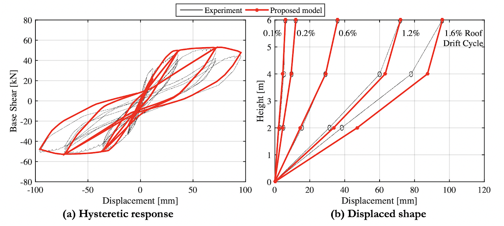

The different tools outlined throughout O'Reilly and Sullivan (2019) to model the behaviour of the beam-column elements in addition to the beam-column joints are included here and their use illustrated. This way users can adopt the proposed numerical modelling approach proposed by the authors using single procedure commands within OpenSees. This model outlines the response of the three storey frame tested by Calvi et al. [2002] which was a frame designed for gravity loading only, whose comparison is shown below.

For the latest version of the tool, please visit the Github page [here](https://github.com/gerardjoreilly/Numerical-Modelling-of-GLD-RC-Frames).

## Relevant references:
1. **O’Reilly GJ**, Sullivan TJ. Modeling Techniques for the Seismic Assessment of the Existing Italian RC Frame Structures. Journal of Earthquake Engineering 2019; 23(8): 1262–1296. DOI: 10.1080/13632469.2017.1360224. [[PDF](http://gerardjoreilly.github.io/files/Journal/J10-2019_O’Reilly, Sullivan_Modeling Techniques for the Seismic Assessment of the Existing Italian RC Frame Structures.pdf)][[Link](https://www.tandfonline.com/doi/full/10.1080/13632469.2017.1360224)]
